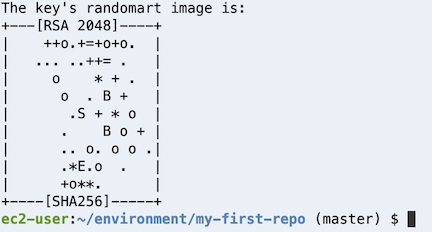
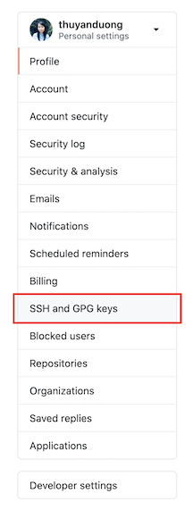
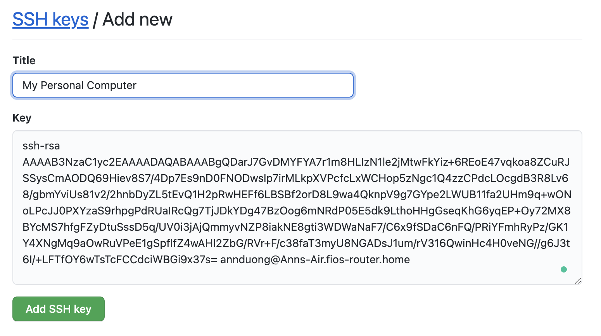

## Configuring Github with your Terminal

1. In your Terminal, Run the following lines:

```sh
git config --global user.name "Your Name"
git config --global user.email "Your Github Email Address"
git config --global credential.helper store
```

2. Confirm that the configuration was successful by running `git config --global user.name`. The terminal should print out your name. Next, run `git config --global user.email`. The terminal should print our your email address.

## Add SSH Key

While we're configuring GitHub, we should add a new SSH key to allow you to push and pull from Github using SSH. 

1. First, check if you already have an SSH key by running `cat ~/.ssh/id_rsa.pub`. If the terminal prints out a long string of characters starting with ssh-rsa, you've already got a key.

2. If the running previous step printed "No such file or directory", then run `ssh-keygen` to create a key. Leave everything blank and press enter for the default location and no passphrase. You should be prompted to select a file and passphrase for your new key. Leave everything blank and press enter for the default location and no passphrase. If you’re asked if you want to overwrite, then you already have an SSH key, and you do not want to overwrite it. If you've done every correctly, you should be something like this printed to your terminal:



Run `cat ~/.ssh/id_rsa.pub` in your terminal. Copy the output (starting from `ssh-rsa`). You'll need it for the next step

3. Navigate to the homepage of Github in your browser. Go to your account settings:


Click "SSH and GPG Keys":



Click the "New SSH key" button:


Put a description title. For example, if you are setting up your AWS Cloud 9, add a title of "Cloud 9". Otherwise, put something like "Personal Computer". Paste the key in the text area and click "Add SSH key".

