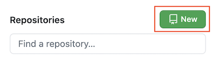
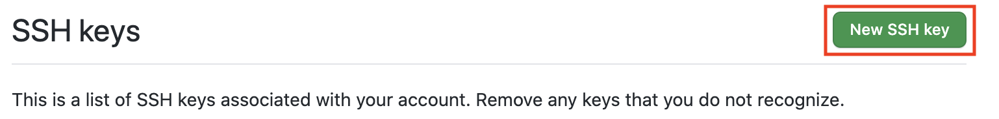

# Configure Your Github Account in AWS Cloud9

You will be using Github individually and collaboratively. We will set up your computer to be able to communicate with your Github account. You'll be able to clone code from a
remote repo using SSH and make changes to it on your computer.

### Create a Github Account

[Create a free Github Account](https://github.com/join). Remember the email and username that you enter. If you already have one, you can skip to the next step.

## Configuring Github with your Terminal

1. In your Terminal, Run the following lines. Be sure to replace `Your Name` and `Your Github Email Address` with your actual Github login information:

```sh
git config --global user.name "Your Name"
git config --global user.email "Your Github Email Address"
git config --global credential.helper store
```

2. Confirm that the configuration was successful by running `git config --global user.name`. The terminal should print out your name. Next, run `git config --global user.email`. The terminal should print our your email address.

### Create a Repository on Github

1. Navigate to Github in the browser and log in. ON the left, click the button to create a new repository.



2. Name your repository `my-first-repo`. Choose to add a README.md file. Create the repository.


## Add SSH Key

While we're configuring GitHub, we should add a new SSH key to allow you to push and pull from Github using SSH. 

1. First, check if you already have an SSH key by running `cat ~/.ssh/id_rsa.pub`. If the terminal prints out a long string of characters starting with ssh-rsa, you've already got a key.

2. If the running previous step printed "No such file or directory", then run `ssh-keygen` to create a key. Leave everything blank and press enter for the default location and no passphrase. You should be prompted to select a file and passphrase for your new key. Leave everything blank and press enter for the default location and no passphrase. If you’re asked if you want to overwrite, then you already have an SSH key, and you do not want to overwrite it. If you've done every correctly, you should be something like this printed to your terminal:


Run `cat ~/.ssh/id_rsa.pub` in your terminal. Copy the output (starting from `ssh-rsa`). You'll need it for the next step

3. Navigate to the homepage of Github in your browser. Go to your account settings:


Click "SSH and GPG Keys":


Click the "New SSH key" button:



Put a description title. For example, if you are setting up your AWS Cloud 9, add a title of "Cloud 9". Otherwise, put something like "Personal Computer". Paste the key in the text area and click "Add SSH key".


### Clone Using SSH

1. Go back to your repository on Github. Then, click on the Code button and make sure the pop-up has "SSH" underlined and selected. The url should start with `git@github.com:...`. If this is not the case, click the link that say `SSH`. Copy that URL in the text box.


2. Back in your Cloud9 terminal, make sure that you have a `Unit-0` folder and that your "working directory" is your `Unit-0` folder. If not, `cd Unit-0` to jump into it. Clone down the project using `git clone <ssh_url>`, replacing `<ssh_url>` with the URL you copied from the previous step. If asked, "Are you sure you want to continue connecting", type `yes`. 

3. Then change directory into your project `cd my-first-repo` or whatever you named your repository. 

4. Once your repo can been cloned down, use the Cloud9 IDE to update the `README.md` **inside of your `my-first-repo` project**. This is not to be confused with the `README.md` in the root folder of your AWS Could 9. You should speficially open and edit the one in your `my-first-repo` folder. **Add a 3-4 sentence bio about yourself**. Be sure to save the file.

5. Push the changes back up to Github using best practices. In the terminal, run:
```sh
git status
git add README.md
git commit -m "added bio"
git push
```
6. Go back to Github to view your repository in the browser. Refresh the page and confirm that you see your newly added bio!

# Final Step

Once you have completed all the steps in these instructions, reach out to a technical instructor to verify you are finished. 
